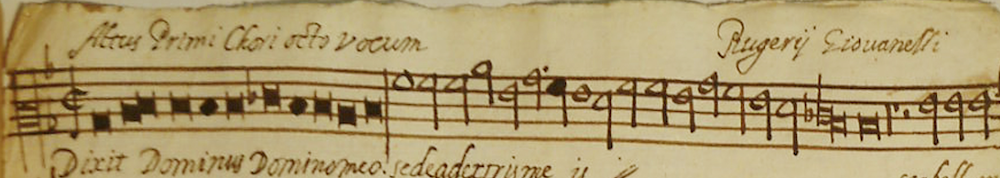

# Barline
In mensural notation no explicit measures are encoded. However, it's usual to find barlines in the middle of the staff.

## Single barlines

```xml
    ...
    <note> ... </note>
    <barLine>
    <note> ... </note>
    ...
```

**TO-DO: rest of MEI encodings**


## Double barlines


## End of plain chant
Sometimes they are used to denote the end of a plain chant section:


## Ending barlines

